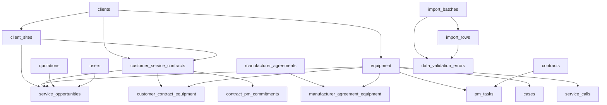

# Biomedical Inventory ERP Web App v4

## Current checkpoint: database-foundation

This branch is paused at a safe database-foundation checkpoint. It keeps the existing IRM workflows intact while adding the structural base for normalized database work, master data, and an Administration Data Management Center.

Included in this checkpoint:

- Database foundation migrations for normalized manufacturers, suppliers, client sites, locations, equipment categories, import staging, validation errors, audit events, and status history.
- Master-data foundation services and APIs for canonical manufacturers, suppliers, equipment categories, aliases, and related reference data.
- Administration -> Data Management Center staging foundation at `/administration/data-management`.
- Template registry, template downloads, import staging, validation-error review, import history, and limited export preview/download.
- Sidebar consistency fix in the shared ERP shell.
- Docker Compose startup port alignment for the app container.
- Architecture, schema, router/model, call-graph, import/export, and Data Management documentation under `docs/`.

Deliberately not included yet:

- Production-table import execution from staged Data Management batches.
- Mapping profile persistence.
- Duplicate merging or automated alias resolution.
- Validation correction editing.
- New department workflows or stock/procurement side effects from imports.

The SQLite file `app/data/inventory.db` is local development/runtime state and is intentionally ignored by Git. Rebuild or reset it from Alembic migrations when the schema changes; do not commit runtime database churn.

### Run locally

```bash
python3 -m venv .venv
source .venv/bin/activate
pip install -r requirements.txt
python3 -m uvicorn app.main:app --reload
```

Open:

```text
http://127.0.0.1:8000
```

This repository root is a FastAPI app and intentionally has no root `package.json`. Do not start it with `npm`, `npx`, or Expo. The only Node package in this repo is `pm-frontend`, which is the source project for the bundled PM interface and must be run from `pm-frontend/` when frontend asset work is required.

Default local credentials are controlled by environment variables and fall back to:

```text
APP_USERNAME=admin
APP_PASSWORD=admin123
```

### Database and file storage

For SQLite development, the app defaults to:

```text
sqlite:///./app/data/inventory.db
```

Use these environment variables when needed:

```bash
export DATABASE_URL="sqlite:///./app/data/inventory.db"
export DB_PATH="./app/data/inventory.db"
export IRM_DATA_ROOT="$HOME/IRM-data"
```

For local PostgreSQL:

```bash
export POSTGRES_PASSWORD="change-me"
docker compose up --build
```

The app service listens on container port `8080`; Compose maps `${IRM_APP_PORT:-8000}` to `8080`.

### Verification commands

Use these before changing this checkpoint:

```bash
python3 -m compileall app tests
python3 -m unittest tests.test_database_foundation -v
python3 -m unittest tests.test_master_data_backfill -v
python3 -m unittest tests.test_data_management_center -v
python3 -m unittest tests.test_aftermarket_service_reports tests.test_quotation_generator -v
python3 -m unittest discover -s tests -v
node --check app/static/app_layout.js
```

Known at this checkpoint: the full legacy suite still has older workflow failures documented in `docs/database/foundation-stabilization-review.md` and `docs/architecture/data-management-structural-review.md`.

### Key documentation

- `docs/architecture/current-architecture.md`
- `docs/architecture/current-call-graph.md`
- `docs/architecture/data-management-call-graph.md`
- `docs/architecture/database-model-overview.md`
- `docs/architecture/legacy-boundaries.md`
- `docs/architecture/dead-code-review.md`
- `docs/architecture/next-architecture-milestone.md`
- `docs/database/foundation-implementation.md`
- `docs/database/foundation-stabilization-review.md`
- `docs/database/router-model-matrix.md`
- `docs/architecture/data-management-structural-review.md`
- `docs/data-management/overview.md`
- `docs/data-management/current-status.md`
- `docs/data-management/dataset-registry-review.md`
- `docs/data-management/import-workflow.md`
- `docs/data-management/export-workflow.md`
- `docs/data-management/security.md`

### Architecture overview

The documented production entry point is `app.main:app`. It mounts static assets, applies session/auth middleware, initializes the legacy runtime tables that are still active, and registers the canonical routers under `app/routers/` plus the still-active legacy routers for ERP, quotations, admin, and aftermarket service reports.

The current architecture is deliberately hybrid: legacy sqlite3 workflows remain active for warehouse, sales, procurement, and service behavior, while SQLAlchemy/Alembic now owns the normalized foundation for master data, import staging, validation errors, audit events, and status history. The next milestone is to move department workflows behind domain services without changing user-visible behavior.

### Department and module status

Dashboard, Sales, Procurement, Warehouse, Aftermarket, CRM, Administration, and Data Management routes are active. The shared sidebar is generated by `app/static/app_layout.js` and styled by `app/static/theme.css`; page-specific sidebar styling should not be added.

The Data Management Center is a staging and governance foundation only. It can download templates, stage CSV/XLSX uploads, review validation errors, show import history, and preview/download limited registered exports. It intentionally does not execute staged rows into production department tables yet.

### Known limitations

- The documented full-suite command is `python3 -m unittest discover -s tests -v`; `tests/__init__.py` also lets root discovery find the suite, but `-s tests` is the explicit checkpoint command.
- `audit_log` remains for legacy/admin runtime audit behavior; `audit_events` is the canonical SQLAlchemy audit table for new foundation work.
- Legacy sqlite3 paths still exist and fail clearly under PostgreSQL until department services are migrated.
- `pm-frontend/` is not required to run FastAPI; it is only needed when rebuilding the bundled PM React assets.

## Added in v4

- Uses your latest `Deduplicated_Physical_Stock_Sheet` as seed data
- Follows `Expected Qty` as baseline quantity
- Quick physical quantity editing directly from the inventory table
- Audit trail/history for imports, edits, deletes, transactions, photo uploads, and quick quantity edits
- Barcode-based IN / OUT stock transactions
- Purchase order tracking
- Link transactions to purchase order numbers
- QR label generation and print page
- Per-item QR image endpoint
- Excel export now includes:
  - inventory
  - summary
  - missing/found/stale/multi-location reports
  - transactions
  - purchase orders
  - audit trail

## Run

```bash
cd biomed_inventory_app
./run_local.sh
```

Or manually:

```bash
python3 -m venv .venv
source .venv/bin/activate
pip install -r requirements.txt
uvicorn app.main:app --reload
```

Open:

```text
http://127.0.0.1:8000
```

## ERP database foundation and MDManser read connector

Setup:

```bash
pip install -r requirements.txt
alembic upgrade head
python scripts/import_mdmanser_html_excel.py "/path/to/MDmanser-05-24-2026.xls"
python scripts/import_pm_tracker.py "/path/to/pm_tracker_with_hospital_contracts_pmcount_from_source-1.xlsx"
python scripts/verify_erp_foundation.py
```

Run with an authenticated MDManser PHP session:

```bash
export MDMANSER_BASE_URL="https://cmm.mdmanser.com"
export MDMANSER_PHPSESSID="your_current_php_session_id"
python3 -m uvicorn app.main:app --reload
```

Open:

```text
http://127.0.0.1:8000/docs
http://127.0.0.1:8000/static/mdmanser.html
http://127.0.0.1:8000/mdmanser
```

Connector endpoints:

```bash
curl "http://127.0.0.1:8000/api/erp/mdmanser/status"
curl "http://127.0.0.1:8000/api/erp/mdmanser/calendar/raw?month=5&year=2026"
curl -X POST "http://127.0.0.1:8000/api/erp/mdmanser/calendar/import?month=5&year=2026"
curl "http://127.0.0.1:8000/api/erp/mdmanser/calendar/events"
```

Read-only connector smoke test:

```bash
python scripts/test_mdmanser_read.py
```

The MDManser connector reads `MDMANSER_PHPSESSID` only from the environment. The app does not hardcode credentials, store the PHP session cookie in the database by default, or return cookies in API responses. The connector uses HTTPS and request timeouts, and this read integration does not write to MDManser.

## Important notes

- Barcode scanning uses a browser library and needs camera permission.
- QR labels are printable from the app using `Generate QR Labels`.
- Photos are stored locally in `app/uploads/`.
- Excel remains the linked output source through `EXCEL_PATH`.
- Purchase orders are stored in the app database and exported to Excel.

## Google Drive Excel sync

Use Google Drive for Desktop and set:

```bash
export EXCEL_PATH="/path/to/Google Drive/My Drive/Stock/inventory_master.xlsx"
uvicorn app.main:app --reload
```


## v4.1 fix

This version fixes Excel import for printable/deduplicated sheets where the actual header row is not row 1.
The importer now scans the first 15 rows and finds the row containing `PN`, `Item / PN`, `Part Number`, or `Item`.


## v4.2 Purchase Order Item Receiving

New PO workflow:

1. Create/select a PO.
2. Add item lines to the PO:
   - PN
   - description
   - quantity
   - target location
   - barcode
3. Change PO status to `RECEIVED`, or click `Receive PO Now`.
4. The app automatically:
   - adds the item to stock if it does not exist
   - increases physical quantity if the item already exists
   - creates an IN transaction
   - links the transaction to the PO number
   - creates audit trail history
   - exports PO items to Excel sheet `PURCHASE_ORDER_ITEMS`


## v4.3 Transaction reference logic

Transactions now follow this rule:

- `IN` transaction requires a Purchase Order number.
- `OUT` transaction requires a Client Order number.
- OUT transactions can also store client/hospital name.
- Client orders are auto-created when an OUT transaction is recorded.
- Purchase orders are auto-created when an IN transaction is recorded.
- Excel export includes `CLIENT_ORDERS`.


## v4.4 UI cleanup

- Cleaner layout and spacing
- Improved mobile responsiveness
- Sticky navigation tabs
- Cleaner inventory toolbar
- Removed duplicated inventory filters
- Better button styling
- Improved table/card behavior on phones
- Cleaner modal forms


## v4.5 Clean Inventory + Bulk PO Items

Added:
- Clean Inventory View for normal daily use
  - photo
  - PN
  - description
  - expected quantity only
  - barcode
  - location
- Audit/Edit Inventory remains separate
- Bulk Add Items to Purchase Order
  - paste one line per item
  - supported separators: tab, comma, semicolon, pipe
  - format: PN | Description | Qty | Location | Barcode


## v4.6 Audit Approval + Dropdown Bulk Transactions

Added:
- Approve Audit → Expected Qty
  - generates mismatch report first
  - then sets Expected Qty = approved Physical Qty
  - resets difference to 0 and status to MATCHED
- Mismatch report download
- Clean Inventory remains simple expected-qty view
- Transactions now support multiple item lines using + Add Item
- Transaction items are selected from dropdown, not typed manually
- PO items are selected from dropdown, not typed manually
- Bulk add is now plus-line based instead of paste/manual entry


## v4.7 Navigation, QR, exports, scanner cleanup

Added:
- Moved KPI boxes into a left burger menu
- Moved Audit/Edit Inventory and Audit History into the burger menu
- Removed QR column from Audit/Edit Inventory
- Added QR column to Clean Inventory
- Added Quick Scan PN/Description in Audit/Edit Inventory
- Added PO Excel export from Transactions and Purchase Orders
- Added Client Order Excel export from Transactions
- QR label payload now includes PN and description
- Printed QR labels show PN and description clearly

## v4.8 Login + Portal Modules

### Local run with credentials

```bash
export APP_USERNAME=admin
export APP_PASSWORD='change-me'
export SESSION_SECRET='some-long-random-secret'
uvicorn app.main:app --reload
```

### Cloud Run environment variables

Set these env vars in Cloud Run deployment:
- `APP_USERNAME`
- `APP_PASSWORD`
- `SESSION_SECRET`

### New routing and auth behavior
- `/` now redirects to `/login` when logged out, and `/portal` when logged in.
- `/login` serves login form and validates credentials server-side.
- `/logout` clears session and redirects to login.
- `/inventory` serves the existing inventory interface.
- `/portal` serves module cards (Inventory, PM Tracking, Reports, Admin/Settings placeholder).
- `/pm` serves the PM Tracking module shell with PM-specific navigation and PM workflows.
- Existing inventory APIs and QR/export endpoints remain available but require authentication.

## v4.9 Module-Specific Navigation

The app now behaves as authenticated mini-app modules under the shared portal:
- `/portal` shows module cards for Inventory, PM Tracking, Reports, and Admin/Settings.
- `/inventory` contains only inventory navigation: Clean Inventory, Audit/Edit Inventory, Transactions, Purchase Orders, Client Orders, Audit History, QR Labels, and Reports/Exports.
- `/pm` and `/pm/*` contain a separate PM module shell with its own PM-only burger menu.

PM module routes:
- `/pm`
- `/pm/dashboard`
- `/pm/due`
- `/pm/schedule`
- `/pm/calendar`
- `/pm/completed`
- `/pm/equipment`
- `/pm/assets`
- `/pm/engineers`
- `/pm/reports`
- `/pm/history`

PM API endpoints:
- `/api/pm-assets`
- `/api/pm-tasks`
- `/api/pm-history`
- `/api/pm-dashboard`
- `/api/pm-calendar`
- `/api/pm-reports`
- `/api/pm-import`

PM database additions:
- `pm_assets`
- `pm_tasks`
- `pm_history`
- optional transaction linkage fields: `pm_asset_id`, `pm_asset_tag`

PM assets can link to inventory spare-part PN, barcode, serial number, hospital/client, department, location, engineer, contact email, contract number/dates, service history, and OUT transactions for parts used during PM service. The PM module also supports PM CSV/Excel import and downloadable PM asset, contract, history, completion, overdue, hospital schedule, and engineer assignment reports. Existing inventory APIs remain in their current namespace (`/api/items`, `/api/transactions`, `/api/purchase-orders`, `/api/client-orders`, `/api/audit`, `/api/export`, QR endpoints).

## v5.0 Client-Centric CRM Workspace

The ERP now includes a client CRM navigation layer:
- `/crm` lists hospital/client workspaces.
- `/crm/client/{id}` opens a dedicated client ERP profile.
- Client section routes include `/equipment`, `/contracts`, `/warranty`, `/pm`, `/service-calls`, `/purchase-orders`, `/client-orders`, `/offers`, `/contacts`, `/communications`, `/reports`, `/attachments`, and `/notes`.

CRM API namespace:
- `/api/crm/clients`
- `/api/crm/client/{id}`
- `/api/crm/client/{id}/equipment`
- `/api/crm/client/{id}/contracts`
- `/api/crm/client/{id}/pm`
- `/api/crm/client/{id}/offers`
- `/api/crm/client/{id}/service-calls`
- `/api/crm/client/{id}/contacts`
- `/api/crm/client/{id}/communications`
- `/api/crm/client/{id}/client-orders`
- `/api/crm/client/{id}/purchase-orders`
- `/api/crm/client/{id}/reports`

New CRM tables are additive and non-destructive:
- `clients`
- `crm_contacts`
- `crm_communications`
- `service_calls`
- `quotations`
- `crm_attachments`

Existing PM assets can now carry client and warranty fields (`client_id`, `warranty_start`, `warranty_end`, `warranty_status`, `vendor`, `warranty_notes`). Clients are automatically discovered from PM asset hospitals, client orders, and transaction client names. Editing permissions are role-aware through the session role, with `APP_ROLE` defaulting to `admin` for local development.

## v5.1 Unified Contract Intelligence Domains

Contract Intelligence remains one Service Department module. Inside that hub it separates two independent domains: Manufacturer Coverage represents agreements between the manufacturer and our company as distributor, and Customer Service Contracts represent contracts between our company and hospitals, clinics, laboratories, or other end users.

Never infer customer service contract coverage from manufacturer coverage. Never infer manufacturer coverage from a customer service contract.

Lifecycle classifications are computed on the backend and are not stored as permanent equipment state:
- `CONTRACTED`
- `UNDER_WARRANTY_NOT_CONTRACTED`
- `WARRANTY_EXPIRING_SOON_NOT_CONTRACTED`
- `OUT_OF_WARRANTY_NOT_CONTRACTED`
- `WARRANTY_UNKNOWN_NOT_CONTRACTED`

Scoring is centralized in `app/services/service_intelligence.py`. Initial rules add points for no active service contract, expired or expiring warranty, unknown warranty, overdue PM, missing completed PM in the last 12 months, open/repeated corrective cases, and equipment age greater than eight years. Priorities are `HIGH` at 80+, `MEDIUM` at 50-79, and `LOW` below 50.

Database addition:
- `service_opportunities`, added by Alembic migration `20260723_service_contract_intelligence.py`

API endpoints:
- `GET /api/service-intelligence/summary`
- `GET /api/service-intelligence/opportunities`
- `GET /api/service-intelligence/opportunities/{id}`
- `POST /api/service-intelligence/refresh`
- `PATCH /api/service-intelligence/opportunities/{id}`
- `GET /api/service-intelligence/export`

The API uses the Contract Intelligence permission boundary (`service_intelligence.view`). Opportunity changes and refreshes write to the existing `audit_events` table. Refresh is idempotent for open opportunities, updates still-applicable opportunities, dismisses no-longer-applicable open opportunities, and preserves `WON` / `LOST` history.

Import matching support should use the existing Data Management Center row and validation-error flow. Serial matching is normalized by trimming whitespace, using consistent case, and removing formatting spaces for matching while preserving the original serial display value. Never match equipment by model alone; flag missing serials, duplicate serials, ambiguous client/site matches, invalid dates, warranty end before start, contract end before start, and unmatched contract equipment.

Run migrations with:

```bash
alembic upgrade head
```

Focused validation:

```bash
python3 -m unittest tests.test_service_intelligence tests.test_static_layout tests.test_data_management_center -v
```

### Service Contract Intelligence Imports And Navigation

Final source tables reused or added by the feature:
- `clients` -> parent customer records.
- `client_sites` -> optional physical site records for imported installed-base rows.
- `equipment` -> installed base, serial number, model, manufacturer, installation date, warranty dates, PM dates.
- `equipment_models`, `manufacturers`, `equipment_categories` -> model/manufacturer/category references.
- `manufacturer_agreements` -> manufacturer agreement headers.
- `manufacturer_agreement_equipment` -> GE ANNEXURE/manufacturer-covered equipment, last covered dates, global order numbers, manufacturer values, and EOSL dates.
- `customer_service_contracts` -> end-user/customer service contract headers, values, coverage types, response time, owner, and renewal status.
- `customer_contract_equipment` -> equipment linked to customer contracts and labor/parts/calibration/travel flags.
- `contract_pm_commitments` -> PM visits per year, completed visits, next PM, and PM commitment status.
- `pm_tasks` -> PM history and next due dates.
- `cases` and `service_calls` -> corrective-maintenance signals.
- `service_opportunities` -> refreshable opportunity workflow records.
- `import_batches`, `import_rows`, `data_validation_errors`, `audit_events` -> import staging, validation, reconciliation, and audit trail.

Foreign-key relationships:



Contract Intelligence / Manufacturer Coverage templates:
- `manufacturer_agreements_import_template.xlsx`
- `manufacturer_covered_equipment_import_template.xlsx`
- `equipment_warranty_import_template.xlsx`
- `manufacturer_eosl_import_template.xlsx`

Contract Intelligence / Customer Contracts templates:
- `installed_equipment_import_template.xlsx`
- `service_contracts_import_template.xlsx`
- `contract_equipment_import_template.xlsx`
- `preventive_maintenance_import_template.xlsx`
- `service_opportunities_import_template.xlsx`

Recommended import order:
1. Clients
2. Client Sites
3. Manufacturers
4. Equipment Categories
5. Installed Equipment
6. Equipment Warranties
7. Service Contracts
8. Contracted Equipment
9. Preventive Maintenance History
10. Service Cases
11. Refresh Service Opportunities

Contract Intelligence frontend routes:
- `/service/contract-intelligence`
- `/service/contract-intelligence/opportunities`
- `/service/contract-intelligence/manufacturer-coverage`
- `/service/contract-intelligence/customer-contracts`
- `/service/contract-intelligence/warranties`
- `/service/contract-intelligence/uncovered-equipment`
- `/service/contract-intelligence/coverage`
- `/service/contract-intelligence/customers`
- `/service/contract-intelligence/equipment`
- `/service/contract-intelligence/reconciliation`
- `/service/contract-intelligence/reports`
- `/service/contract-intelligence/settings`
- Legacy `/administration/manufacturer-coverage` and `/service/customer-contracts` URLs serve the central Contract Intelligence hub.

Sidebar and related navigation:
- Service Department sidebar includes Dashboard, Cases, Preventive Maintenance, Contracts, Installed Base, Contract Intelligence, Quotations, and Reports.
- Contract Intelligence sub-navigation includes Overview, Opportunities, Manufacturer Coverage, Customer Contracts, Warranty Expirations, Uncovered Equipment, Coverage Analysis, By Customer, By Equipment, Import & Reconciliation, Reports, and Settings.
- Client detail links open filtered Contract Coverage, Uncovered Equipment, Service Opportunities, and Warranty Expirations.
- Equipment detail links open Manufacturer Coverage, Customer Contracts, and Opportunities inside Contract Intelligence.
- Service dashboard Contract Intelligence cards open filtered manufacturer opportunity, customer opportunity, warranty, uncovered-equipment, contract, and reconciliation views.

Permission matrix:
- `service_intelligence.view`: read Contract Intelligence pages and API.
- `service_intelligence.refresh`: manually refresh opportunities.
- `service_intelligence.manage_opportunities`: edit opportunity workflow state.
- `service_intelligence.assign_opportunities`: assign opportunities.
- `service_intelligence.import`: import Contract Intelligence datasets.
- `service_intelligence.export`: export filtered opportunity lists.
- `service_intelligence.reconcile`: review and resolve reconciliation issues.
- `service_intelligence.configure`: access settings.
- `manufacturer_agreements.view`, `manufacturer_agreements.manage`, `manufacturer_agreements.import`, `manufacturer_agreements.reconcile`, `manufacturer_agreements.view_values`: manufacturer-domain controls inside Contract Intelligence.
- `customer_contracts.view`, `customer_contracts.manage`, `customer_contracts.import`, `customer_contracts.renew`, `customer_contracts.view_values`, `contract_pm.manage`: customer-domain controls inside Contract Intelligence.

User walkthrough:
1. Open Service Department from the sidebar.
2. Choose Contract Intelligence.
3. Use the sub-navigation for Opportunities, Manufacturer Coverage, Customer Contracts, Warranty Expirations, Uncovered Equipment, Coverage Analysis, Customers, Equipment, Import & Reconciliation, Reports, or Settings.
4. Use Import & Reconciliation to download templates and open the Data Management Center import wizard.
5. Upload, preview, validate, review errors, then commit only clean supported batches.
6. Resolve unmatched rows in Data Reconciliation, then refresh opportunities.
