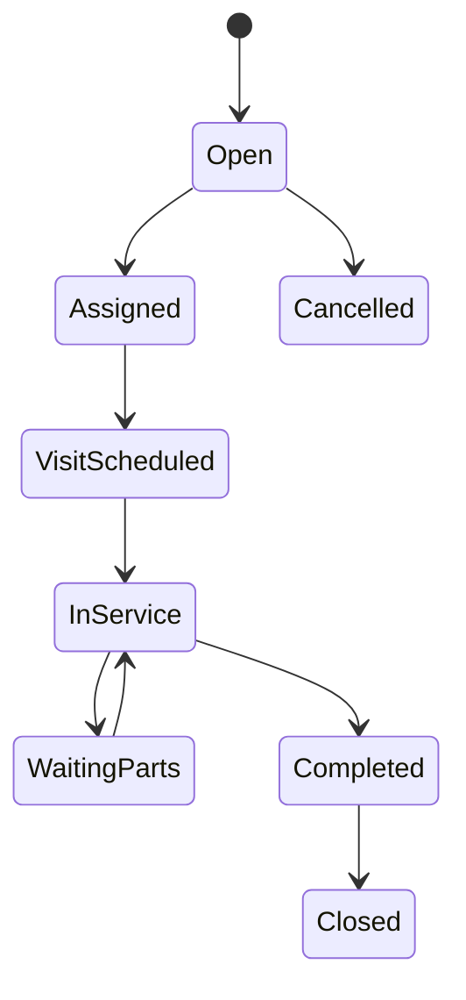
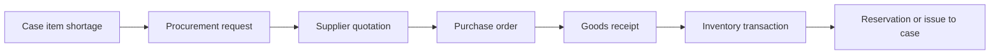
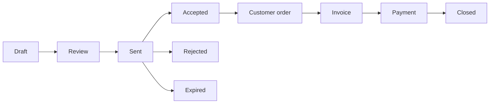
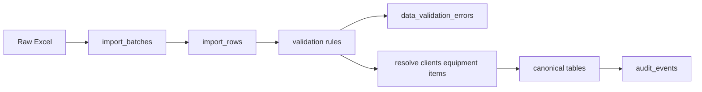
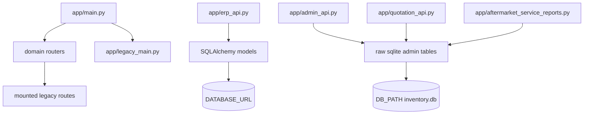

# Target Database Architecture

This target design is based on the current code findings: ORM master/transaction tables exist, legacy SQLite tables still carry important operational data, and imports currently denormalize equipment/service-report facts. The design keeps source facts normalized and exposes a reporting view instead of creating one physical master table.

## Identity and access
| table | purpose | primary_key | important_columns | foreign_keys | unique_constraints | recommended_indexes | retention_behavior | soft_delete_policy |
| --- | --- | --- | --- | --- | --- | --- | --- | --- |
| users | Application identity and staff login/profile record | id | username, full_name, email, phone, active, deleted_at | none initially; roles through user_roles | username unique, email unique if populated | username, email, active | retain; deactivate rather than delete | yes |
| roles | Named access role | id | name, description, is_system, active | none | name unique | name, active | retain role history; do not delete used roles | yes |
| permissions | Atomic permission names used by middleware/UI | id | name, description, module, action | none | name unique | module, action | retain; deactivate deprecated permissions | yes |
| user_roles | Many-to-many assignment of users to roles | user_id, role_id | user_id, role_id, assigned_at, assigned_by | user_id -> users.id RESTRICT; role_id -> roles.id RESTRICT | user_id + role_id unique | user_id, role_id | retain assignments; end-date if audit required | no; use revoked_at |
| role_permissions | Many-to-many role permission grants | role_id, permission_id | role_id, permission_id, granted_at | role_id -> roles.id RESTRICT; permission_id -> permissions.id RESTRICT | role_id + permission_id unique | role_id, permission_id | retain; revoke instead of hard delete when audited | no; use revoked_at |
| engineers | Service engineer profile linked to optional app user | id | user_id, engineer_code, engineer_name, email, phone, active, skill_notes | user_id -> users.id SET NULL | engineer_code unique, engineer_name unique within active records | user_id, engineer_name, active | retain because service visits reference engineers | yes |

## CRM and master data
| table | purpose | primary_key | important_columns | foreign_keys | unique_constraints | recommended_indexes | retention_behavior | soft_delete_policy |
| --- | --- | --- | --- | --- | --- | --- | --- | --- |
| clients | Customer organization/account | id | client_code, name, financial_status, status, tax_id, deleted_at | none | client_code unique, normalized name unique optional | name, status, financial_status | retain; never cascade-delete operational history | yes |
| client_sites | Physical/customer site for a client | id | client_id, site_code, name, city, country, status | client_id -> clients.id RESTRICT | client_id + site_code unique, client_id + name unique | client_id, city, status | retain for equipment/service history | yes |
| departments | Department/unit inside a client site | id | client_id, client_site_id, name, floor_location, phone, email | client_id -> clients.id RESTRICT; client_site_id -> client_sites.id SET NULL | client_site_id + name unique | client_id, client_site_id, name | retain; deactivate old departments | yes |
| contacts | People at clients/sites/departments | id | client_id, client_site_id, department_id, name, title, phone, email, is_primary | client_id -> clients.id RESTRICT; site/department SET NULL | client_id + email unique when email present | client_id, department_id, email | retain contact history; deactivate | yes |
| addresses | Reusable address records | id | owner_type, owner_id, address_type, line1, city, country, postal_code | polymorphic owner or future document_links style references | owner_type + owner_id + address_type unique optional | owner_type, owner_id, city | retain while owner exists; archive old addresses | yes |
| manufacturers | Equipment/item manufacturer master | id | name, normalized_name, country, website, active | none | normalized_name unique | normalized_name, active | retain because models/assets reference it | yes |
| suppliers | Vendor/supplier master | id | supplier_code, name, normalized_name, email, phone, payment_terms, active | none | supplier_code unique, normalized_name unique | name, active | retain due PO/procurement history | yes |
| equipment_categories | Equipment category/type hierarchy | id | parent_id, name, code, risk_default, active | parent_id -> equipment_categories.id SET NULL | code unique, parent_id + name unique | parent_id, code, active | retain; deactivate categories in use | yes |
| equipment_models | Authoritative manufacturer/model catalogue | id | manufacturer_id, category_id, model, description, risk_classification, pm_frequency_default | manufacturer_id -> manufacturers.id RESTRICT; category_id -> equipment_categories.id SET NULL | manufacturer_id + model unique | manufacturer_id, category_id, model | retain because assets reference it | yes |
| equipment_assets | Installed equipment asset | id | asset_number, client_id, client_site_id, department_id, equipment_model_id, serial_number, asset_tag, installation_date, status | client/site/department RESTRICT or SET NULL by policy; equipment_model_id RESTRICT | serial_number unique where present, client_id + asset_tag unique | client_id, department_id, equipment_model_id, serial_number, status | retain; do not delete if service/contract/warranty exists | yes |
| locations | Warehouse or client physical location dictionary | id | location_type, client_site_id, warehouse_id, name, parent_id | client_site_id -> client_sites.id SET NULL; parent_id -> locations.id SET NULL | location_type + parent_id + name unique | location_type, parent_id | retain; deactivate | yes |

## Service and after-sales
| table | purpose | primary_key | important_columns | foreign_keys | unique_constraints | recommended_indexes | retention_behavior | soft_delete_policy |
| --- | --- | --- | --- | --- | --- | --- | --- | --- |
| service_cases | Case/ticket root replacing generic cases | id | case_number, client_id, department_id, equipment_asset_id, case_type, title, priority, current_status, opened_at, closed_at | client_id -> clients.id RESTRICT; department/equipment SET NULL | case_number unique | client_id, equipment_asset_id, current_status, priority, opened_at | retain permanently for service history | yes, closed/archived only |
| service_visits | Engineer visit/work report under a case | id | service_case_id, visit_number, engineer_id, scheduled_at, started_at, completed_at, labor_hours, travel_km, outcome | service_case_id -> service_cases.id RESTRICT; engineer_id -> engineers.id SET NULL | service_case_id + visit_number unique | service_case_id, engineer_id, scheduled_at, completed_at | retain permanently | no hard delete after completion |
| service_case_status_history | Append-only case status transitions | id | service_case_id, from_status, to_status, changed_by, changed_at, notes | service_case_id -> service_cases.id RESTRICT; changed_by -> users.id SET NULL | none | service_case_id, changed_at, to_status | append-only audit history | no |
| service_case_assignments | Engineer/user assignment history | id | service_case_id, engineer_id, assigned_by, assigned_at, released_at, role | service_case_id RESTRICT; engineer/user SET NULL | service_case_id + engineer_id + assigned_at unique | service_case_id, engineer_id, assigned_at | retain assignment history | no; close with released_at |
| service_case_items | Parts/labor/services required by a case | id | service_case_id, inventory_item_id, description, requested_qty, fulfilled_qty, procurement_status | service_case_id RESTRICT; inventory_item_id SET NULL | none | service_case_id, inventory_item_id, procurement_status | retain with case | no after used |
| preventive_maintenance_plans | Recurring PM plan per contract/equipment | id | contract_id, equipment_asset_id, frequency, start_date, end_date, active | contract_id SET NULL; equipment_asset_id RESTRICT | equipment_asset_id + contract_id + start_date unique | equipment_asset_id, contract_id, active | retain plan versions | yes/end-date |
| preventive_maintenance_tasks | Scheduled PM occurrence | id | pm_plan_id, equipment_asset_id, due_date, completed_date, current_status, assigned_engineer_id | pm_plan_id SET NULL; equipment_asset_id RESTRICT; engineer SET NULL | pm_plan_id + due_date unique optional | due_date, current_status, equipment_asset_id | retain completed/missed PM history | no hard delete after due |
| contracts | Service/commercial coverage contract | id | contract_reference, client_id, contract_type, start_date, end_date, status, coverage_notes | client_id -> clients.id RESTRICT | contract_reference unique | client_id, status, end_date | retain; do not cascade to PM/history | yes/expire |
| contract_equipment | Many-to-many coverage of equipment by contract | contract_id, equipment_asset_id | contract_id, equipment_asset_id, coverage_type, start_date, end_date | contract_id RESTRICT; equipment_asset_id RESTRICT | contract_id + equipment_asset_id + start_date unique | contract_id, equipment_asset_id | retain coverage periods | no; end-date |
| warranties | Warranty coverage for equipment | id | equipment_asset_id, client_id, start_date, end_date, status, coverage_notes | equipment_asset_id RESTRICT; client_id RESTRICT | equipment_asset_id + start_date unique | equipment_asset_id, client_id, status, end_date | retain because service decisions depend on past warranty | yes/expire |
| technical_escalations | Escalations to manufacturer/supplier/internal specialist | id | service_case_id, supplier_id, manufacturer_id, opened_at, status, resolution | service_case_id RESTRICT; supplier/manufacturer SET NULL | none | service_case_id, status, opened_at | retain with case | no hard delete after opened |

## Warehouse
| table | purpose | primary_key | important_columns | foreign_keys | unique_constraints | recommended_indexes | retention_behavior | soft_delete_policy |
| --- | --- | --- | --- | --- | --- | --- | --- | --- |
| inventory_items | SKU/spare part master | id | item_code, pn, description, category_id, manufacturer_id, minimum_qty, status | manufacturer_id SET NULL; category lookup SET NULL | pn unique or manufacturer_id + pn unique | pn, manufacturer_id, status | retain; deactivate discontinued items | yes |
| warehouses | Stock-holding warehouse | id | warehouse_code, name, address_id, active | address_id SET NULL | warehouse_code unique, name unique | warehouse_code, active | retain while transactions exist | yes |
| storage_locations | Bin/shelf under warehouse | id | warehouse_id, parent_id, location_code, name, active | warehouse_id RESTRICT; parent_id SET NULL | warehouse_id + location_code unique | warehouse_id, parent_id, active | retain while transactions exist | yes |
| stock_balances | Current stock snapshot by item/location/lot | inventory_item_id, storage_location_id, serial_or_lot_id | on_hand_qty, reserved_qty, available_qty, updated_at | inventory_item_id RESTRICT; location RESTRICT; serial_or_lot SET NULL | inventory_item_id + storage_location_id + serial_or_lot_id unique | inventory_item_id, storage_location_id | derived/snapshot; rebuildable from ledger | no |
| inventory_transactions | Append-only stock ledger | id | transaction_no, inventory_item_id, storage_location_id, direction, qty, unit_cost, source_type, source_id, occurred_at | inventory_item_id RESTRICT; location RESTRICT; user SET NULL | transaction_no unique | inventory_item_id, occurred_at, source_type/source_id | append-only permanent record | no |
| serial_or_lot_numbers | Tracked serial/lot instances | id | inventory_item_id, serial_number, lot_number, expiry_date, status | inventory_item_id RESTRICT | inventory_item_id + serial_number unique, inventory_item_id + lot_number unique | inventory_item_id, serial_number, lot_number | retain due traceability | yes/deactivate |
| stock_reservations | Reservation of stock for case/order | id | inventory_item_id, service_case_id, quotation_id, qty, status, expires_at | inventory_item_id RESTRICT; service_case/quotation SET NULL | none | inventory_item_id, service_case_id, status | retain until fulfilled/cancelled for audit | no hard delete after fulfillment |

## Procurement
| table | purpose | primary_key | important_columns | foreign_keys | unique_constraints | recommended_indexes | retention_behavior | soft_delete_policy |
| --- | --- | --- | --- | --- | --- | --- | --- | --- |
| procurement_requests | Header for procurement need | id | request_no, service_case_id, requested_by, status, needed_by, notes | service_case_id SET NULL; requested_by SET NULL | request_no unique | status, needed_by, service_case_id | retain purchasing history | yes/cancel |
| procurement_request_items | Line items requested | id | procurement_request_id, service_case_item_id, inventory_item_id, requested_qty, approved_qty, status | procurement_request_id RESTRICT; case_item/inventory SET NULL | none | procurement_request_id, inventory_item_id, status | retain with request | no after PO linked |
| suppliers | Same supplier master as CRM/master data domain | id | supplier_code, name, normalized_name, active | none | supplier_code unique, normalized_name unique | name, active | retain due PO history | yes |
| purchase_orders | PO header | id | po_number, supplier_id, status, order_date, expected_date, currency, total_amount | supplier_id RESTRICT | po_number unique | supplier_id, status, order_date | retain financial/legal record | no hard delete after sent |
| purchase_order_items | PO lines | id | purchase_order_id, procurement_request_item_id, inventory_item_id, qty, unit_price, line_total | purchase_order_id RESTRICT; request_item SET NULL; inventory_item SET NULL | purchase_order_id + line_no unique | purchase_order_id, inventory_item_id | retain with PO | no |
| goods_receipts | Receipt of purchased goods | id | receipt_no, purchase_order_id, received_at, received_by, status | purchase_order_id RESTRICT; received_by SET NULL | receipt_no unique | purchase_order_id, received_at, status | retain stock/audit record | no |

## Commercial
| table | purpose | primary_key | important_columns | foreign_keys | unique_constraints | recommended_indexes | retention_behavior | soft_delete_policy |
| --- | --- | --- | --- | --- | --- | --- | --- | --- |
| quotations | Commercial offer header | id | quotation_number, client_id, contact_id, service_case_id, status, quotation_date, valid_until, currency, totals | client/contact/case SET NULL or RESTRICT by policy | quotation_number unique | client_id, status, quotation_date | retain; quotation is offer only | yes/cancel/expire |
| quotation_items | Commercial offer lines | id | quotation_id, equipment_asset_id, inventory_item_id, description, quantity, unit_price, discount_percent, line_total | quotation_id RESTRICT; equipment/inventory SET NULL | quotation_id + line_no unique | quotation_id, inventory_item_id | retain with quotation/version | no |
| quotation_versions | Immutable quotation revisions/snapshots | id | quotation_id, version_no, payload_json, created_by, created_at | quotation_id RESTRICT; created_by SET NULL | quotation_id + version_no unique | quotation_id, created_at | append-only commercial history | no |
| quotation_status_history | Quotation status workflow history | id | quotation_id, from_status, to_status, changed_by, changed_at, notes | quotation_id RESTRICT; changed_by SET NULL | none | quotation_id, changed_at, to_status | append-only | no |
| invoices | Invoice header | id | invoice_number, client_id, quotation_id, service_case_id, status, invoice_date, due_date, total_amount | client RESTRICT; quotation/case SET NULL | invoice_number unique | client_id, status, due_date | retain financial/legal record | no hard delete after issued |
| invoice_items | Invoice lines | id | invoice_id, quotation_item_id, description, quantity, unit_price, line_total | invoice_id RESTRICT; quotation_item SET NULL | invoice_id + line_no unique | invoice_id, quotation_item_id | retain with invoice | no |
| payments | Payment records against invoices | id | invoice_id, payment_reference, amount, paid_at, method, status | invoice_id RESTRICT | payment_reference unique if provided | invoice_id, paid_at, status | retain financial/legal record | no |

## Files and auditing
| table | purpose | primary_key | important_columns | foreign_keys | unique_constraints | recommended_indexes | retention_behavior | soft_delete_policy |
| --- | --- | --- | --- | --- | --- | --- | --- | --- |
| documents | Stored file metadata | id | filename, content_type, storage_path, checksum, uploaded_by, uploaded_at | uploaded_by SET NULL | checksum unique optional | uploaded_by, uploaded_at, content_type | retain according to document policy | yes/archive |
| document_links | Links documents to domain records | id | document_id, entity_type, entity_id, link_type | document_id RESTRICT | document_id + entity_type + entity_id + link_type unique | entity_type, entity_id, document_id | retain while document exists | no |
| audit_events | Append-only audit log | id | actor_user_id, action, entity_type, entity_id, old_value, new_value, occurred_at | actor_user_id SET NULL | none | entity_type/entity_id, occurred_at, actor_user_id | append-only permanent | no |
| import_batches | Import job header | id | import_type, target_table, filename, status, total_rows, valid_rows, error_rows, created_by | created_by SET NULL | none | target_table, status, created_at | retain for traceability | yes/archive |
| import_rows | Raw imported row payloads | id | batch_id, row_no, raw_json, mapped_json, status | batch_id RESTRICT | batch_id + row_no unique | batch_id, status | retain until validation/audit retention expires | yes/archive |
| data_validation_errors | Validation errors from imports/backfills | id | batch_id, import_row_id, entity_type, field, error_code, message, severity | batch/import_row RESTRICT | none | batch_id, severity, field | retain with import batch | yes/archive |

## Master View Requirement
Do not implement the master view as one wide physical table. Use normalized source tables, import staging, validation, and a reporting view.

### `vw_operational_master`
Grain: one row per operational service context. In practical terms this can become service case x visit x required part x quotation/procurement/invoice line where those child records exist. It is not one row per client and not guaranteed to be one row per equipment asset.

Columns should include: client, site, department, contact, equipment category, manufacturer, model, serial number, contract, warranty, service case, service visit, engineer, required parts, procurement state, quotation, invoice, and current operational status.

Multiple rows are expected when: a client has many sites/departments, equipment has many service cases, a case has many visits, a case has many required parts, one part need is split across procurement suppliers, a quotation has many lines/versions, or invoices have many lines/payments.

## State And Enum Policy
Use workflow state/history tables for `service_cases`, `quotations`, `procurement_requests`, `purchase_orders`, and `invoices`. Use lookup tables for configurable master data such as categories, manufacturers, suppliers, and locations. Use check constraints or PostgreSQL enums only for small stable values such as priority. Do not use one universal status table.

## Additional Mermaid Workflow Diagrams

