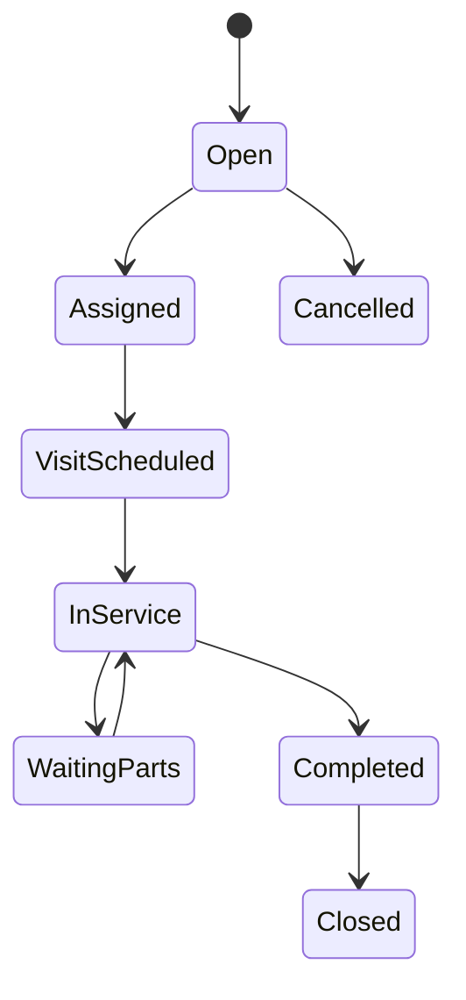
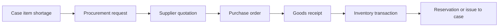
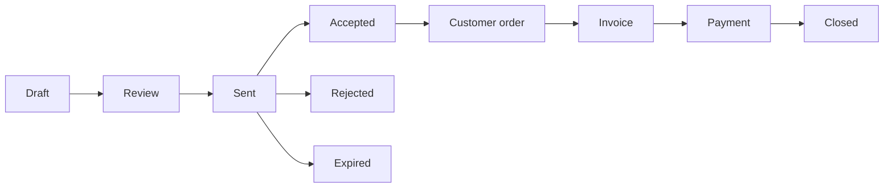
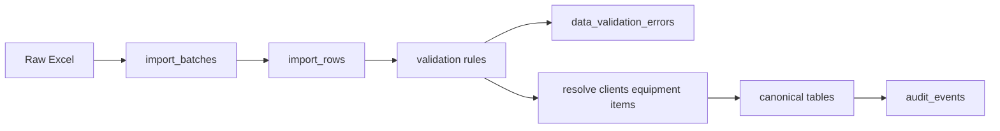
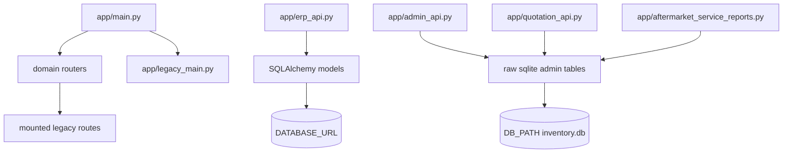

# Workflow Diagrams

## Service Workflow

```mermaid
stateDiagram-v2
  [*] --> Open
  Open --> Assigned
  Assigned --> VisitScheduled
  VisitScheduled --> InService
  InService --> WaitingParts
  WaitingParts --> InService
  InService --> Completed
  Completed --> Closed
  Open --> Cancelled
```

## Procurement Workflow

```mermaid
flowchart LR
  Need[Case item shortage] --> PR[Procurement request]
  PR --> RFQ[Supplier quotation]
  RFQ --> PO[Purchase order]
  PO --> GR[Goods receipt]
  GR --> Stock[Inventory transaction]
  Stock --> Reserve[Reservation or issue to case]
```

## Quotation To Invoice Workflow

```mermaid
flowchart LR
  Draft --> Review --> Sent --> Accepted --> CustomerOrder[Customer order]
  CustomerOrder --> Invoice --> Payment --> Closed
  Sent --> Rejected
  Sent --> Expired
```

## Import And Validation Flow

```mermaid
flowchart LR
  Excel[Raw Excel] --> Batch[import_batches]
  Batch --> Rows[import_rows]
  Rows --> Validate[validation rules]
  Validate --> Errors[data_validation_errors]
  Validate --> Resolve[resolve clients equipment items]
  Resolve --> Canonical[canonical tables]
  Canonical --> Audit[audit_events]
```

## Application Dependency Flow

```mermaid
flowchart TD
  main[app/main.py] --> routers[domain routers]
  main --> legacy[app/legacy_main.py]
  routers --> legacyRoutes[mounted legacy routes]
  erp[app/erp_api.py] --> orm[SQLAlchemy models]
  admin[app/admin_api.py] --> sqlite[raw sqlite admin tables]
  quotation[app/quotation_api.py] --> sqlite
  reports[app/aftermarket_service_reports.py] --> sqlite
  orm --> db[(DATABASE_URL)]
  sqlite --> dbpath[(DB_PATH inventory.db)]
```
